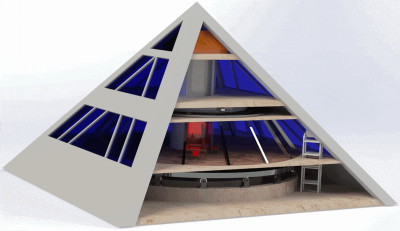
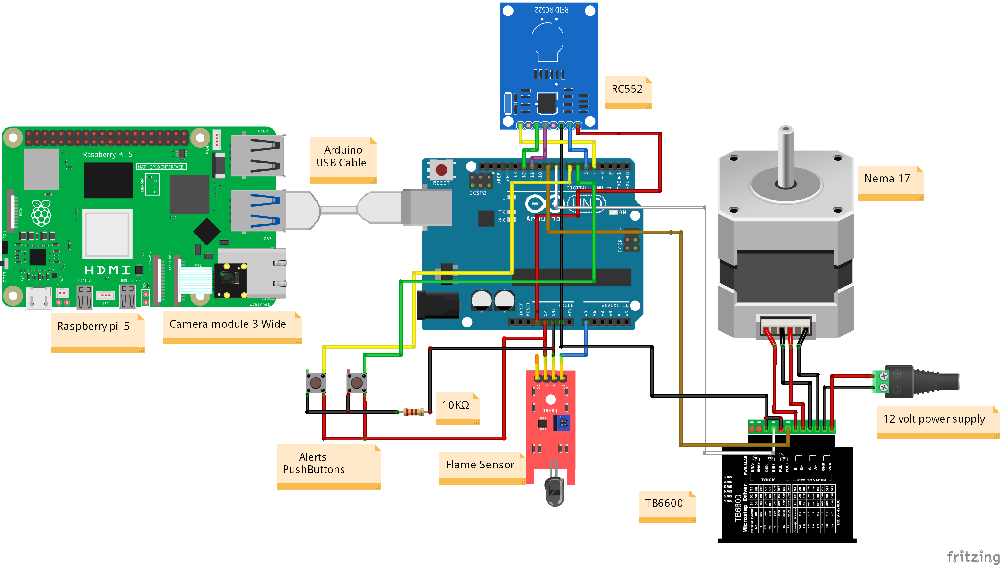
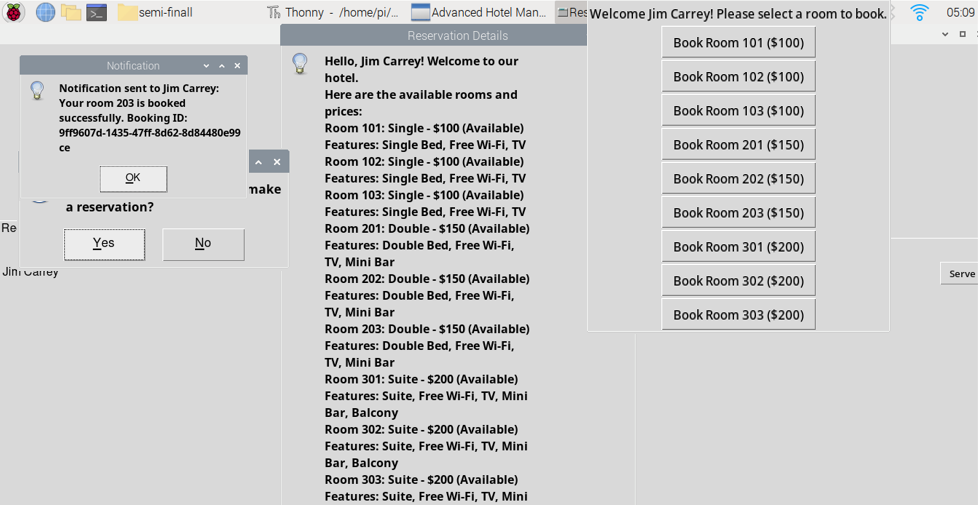
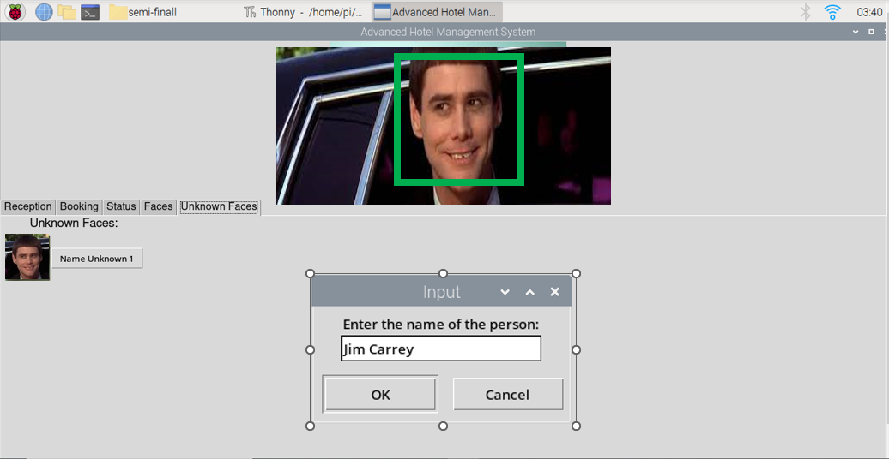
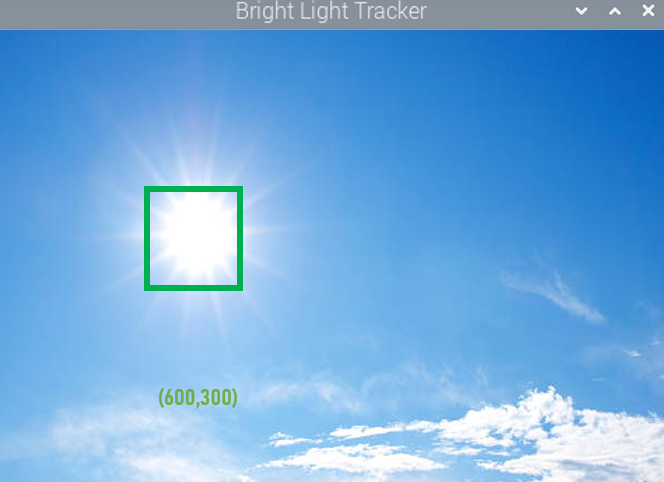
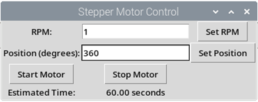
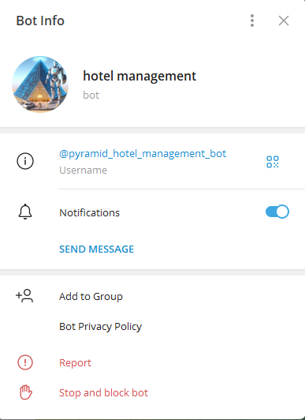

<div align="center">
  
  <br>
  <h1>Revolving Pyramid Hotel</h1>
  <p>
    <strong>IoT hotel management system — face recognition, RFID check-in, PID solar tracking, fire detection, and motor control</strong>
  </p>
  <p>
    
    
    
    
    
    <a href="https://github.com/Salim-Ammar/Revolving-Pyramid-Hotel"></a>
  </p>
</div>

<p align="center">
  <a href="#features">Features</a> ·
  <a href="#system-architecture">Architecture</a> ·
  <a href="#quick-start">Quick Start</a> ·
  <a href="#hardware">Hardware</a> ·
  <a href="#screenshots">Screenshots</a>
</p>

---

A SolidWorks mechanism, a laser-cut wood-and-glass model, and a Raspberry Pi control stack — the revolving hotel started as a graduation project. It runs face recognition check-in, RFID key cards, PID solar tracking, and sends Telegram alerts when the flame sensor picks up fire.

---

## Features

| Feature | Description |
|---------|-------------|
| **Revolving Floors** | NEMA 17 stepper motor + TB6600 driver rotates via 10:1 ring/pinion gear drive |
| **Solar Tracking** | Pi Camera v3 + OpenCV finds brightest light source; PID controller (Kp=0.05, Ki=0.005, Kd=0.01) drives stepper |
| **Solar Panel Tilt** | MG996R servo adjusts panel angle via PID light tracker |
| **Face Recognition Check-in** | OpenCV `face_recognition` — live camera capture, encoding comparison via pickle |
| **RFID Check-in** | MFRC522 card reader (SPI) on Arduino acts as physical key-card backup |
| **Hotel Management GUI** | Multi-tab Tkinter dashboard — 9 rooms, booking, check-in/out, SQLite persistence |
| **Fire & Emergency Detection** | Flame sensor + push buttons on Arduino trigger Telegram alerts with Pi camera snapshot |
| **Telegram Alerts** | Instant fire/emergency notifications with photo via Bot API |

---

---

## System Architecture

```
┌──────────────────────────────┐     UART (9600 baud)     ┌──────────────────────┐
│       Raspberry Pi 5         │ ◄──────────────────────► │     Arduino Uno      │
│                              │                          │                      │
│  ┌────────────────────────┐  │                          │  ┌────────────────┐  │
│  │  hotel_manager.py      │  │                          │  │ Stepper motor  │  │
│  │  (GUI + face + RFID)   │  │                          │  │ control (DIR=9,│  │
│  ├────────────────────────┤  │                          │  │  STEP=8)       │  │
│  │  fire_detector.py      │  │                          │  ├────────────────┤  │
│  │  (Telegram alerts)     │  │                          │  │ MFRC522 RFID   │  │
│  ├────────────────────────┤  │                          │  │ (SPI: 5,4)     │  │
│  │  motor_control.py      │  │                          │  ├────────────────┤  │
│  │  (stepper GUI)         │  │                          │  │ Flame sensor   │  │
│  ├────────────────────────┤  │                          │  │ (analog pin 2) │  │
│  │  light_tracker.py      │  │                          │  ├────────────────┤  │
│  │  (PID solar tracking)  │  │                          │  │ Emergency btns │  │
│  └────────────────────────┘  │                          │  │ (pins 6, 7)    │  │
│  ┌────────────────────────┐  │                          │  └────────────────┘  │
│  │ Pi Camera Module 3     │  │                          └──────────────────────┘
│  │ (640×480, 30 FPS)      │  │
│  └────────────────────────┘  │
└──────────────────────────────┘
```

---

## Quick Start

```bash
# Clone and install
git clone https://github.com/Salim-Ammar/Revolving-Pyramid-Hotel.git
cd Revolving-Pyramid-Hotel
pip install -r requirements.txt

# Upload Arduino firmware
# Open firmware/arduino/pyramid_controller/pyramid_controller.ino
# in Arduino IDE → upload to Arduino Uno

# Run any application
python src/hotel_manager.py     # Hotel management + face recognition + RFID
python src/fire_detector.py     # Fire/emergency detection with Telegram
python src/motor_control.py     # Stepper motor control GUI
python src/light_tracker.py     # PID solar light tracking
```

> **Note:** Before running `fire_detector.py`, replace the Telegram bot token and chat ID placeholders with your own credentials from [@BotFather](https://t.me/BotFather).

### Dependencies

```txt
opencv-python-headless
face_recognition
picamera2
pyserial
Pillow
requests
numpy
```

---

## Hardware

| Component | Qty | Role |
|-----------|:---:|------|
| Raspberry Pi 5 | 1 | Master controller — CV, GUI, databases, Telegram API |
| Arduino Uno | 1 | Real-time motor + sensor slave |
| NEMA 17 Stepper Motor | 1 | Floor rotation drive |
| TB6600 Stepper Driver | 1 | 1/32 microstepping (6400 steps/rev) |
| MG996R Servo | 1 | Solar panel tilt |
| Pi Camera Module 3 Wide | 1 | Solar tracking + face recognition |
| MFRC522 RFID Module | 1 | Card-key check-in |
| Flame Sensor | 1 | Fire detection |
| Push Buttons | 2 | Emergency triggers |

### Pin Connections (Arduino Uno)

| Component | Arduino Pin | Notes |
|-----------|:-----------:|-------|
| Stepper DIR | D9 | TB6600 direction control |
| Stepper STEP | D8 | TB6600 step pulse |
| RFID SS | D5 | MFRC522 SPI slave select |
| RFID RST | D4 | MFRC522 reset |
| RFID SCK | D13 | MFRC522 SPI clock (hardware SPI) |
| RFID MOSI | D11 | MFRC522 SPI data in (hardware SPI) |
| RFID MISO | D12 | MFRC522 SPI data out (hardware SPI) |
| Flame Sensor | A2 | Analog input, threshold 300 |
| Emergency Btn 1 | D6 | Push button (pull-down) |
| Emergency Btn 2 | D7 | Push button (pull-down) |
| UART TX | D1 (TX) | To RPi5 RX (9600 baud) |
| UART RX | D0 (RX) | To RPi5 TX (9600 baud) |
| Common GND | GND | Shared across all modules |



---

## Software Stack

| Layer | Technology |
|-------|-----------|
| **Applications** | `hotel_manager.py` · `fire_detector.py` · `motor_control.py` · `light_tracker.py` |
| **Platform** | Raspberry Pi 5 — Python 3.11 |
| **Communication** | UART Serial (9600 baud) |
| **Firmware** | Arduino Uno — `pyramid_controller.ino` |
| **Peripherals** | Stepper motor · RFID · Flame sensor · Emergency buttons |

---

## Screenshots

| Booking Management | Face Recognition |
|--------------------|------------------|
|  |  |

| Light Tracking | Stepper Control | Telegram Alert |
|----------------|-----------------|----------------|
|  |  |  |

---

## Contributing

Open an issue or submit a PR.

---

## Acknowledgements

- **Supervisor & Faculty** — Mechatronics Engineering Department, University of Latakia
- **Featured on** [Ugarit TV](https://www.facebook.com/share/v/1BWJWWBzJi/) — live interview demonstrating the mechanical design, CNC prototype, and software control stack

---

## License

MIT © 2024 Salim Ali Ammar
